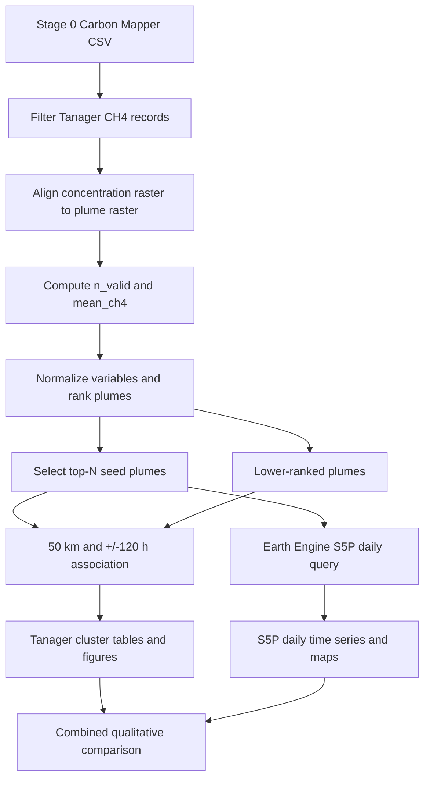

# Stage 1 Technical Reference

## Scope

Stage 1 links high-resolution Tanager methane plume records to coarse
Sentinel-5P methane context in space and time. It consists of a single
notebook:

```text
stage1/stage1_cross_sensor_visibility_final.ipynb
```

The workflow is sequential and file-based. Stage 0 supplies the Carbon Mapper
CSV; Stage 1 produces intermediate tables so every processing step can be
inspected independently.

## Data Flow



## Tanager Filtering

The input table is normalized as follows:

- `datetime` is parsed as UTC;
- latitude and longitude are converted to numeric values;
- gas labels are normalized to `CH4` or `CO2`;
- rows without valid time or coordinates are removed;
- rows are restricted to CH4;
- when `platform` exists, rows are restricted to `TANAGER`.

If no `plume_id` exists, identifiers are generated as:

```text
plume_000000
plume_000001
...
```

These generated IDs are stable only while source row order remains unchanged.

## Raster-mask Statistics

For every filtered plume, Stage 1 opens:

- `plume_tif`: RGB plume visualization/mask raster;
- `con_tif`: concentration raster.

Remote HTTP(S) rasters are opened directly with Rasterio and then through
GDAL `/vsicurl/` as a fallback. The concentration raster is wrapped in a
`WarpedVRT` matching the plume raster CRS, transform, width, and height. It is
resampled with nearest-neighbor interpolation.

The current plume validity mask is:

```text
plume_valid = valid(R) AND valid(G) AND valid(B)
```

It tests raster masks, not RGB color thresholds. Concentration pixels are used
where both the plume validity mask and resampled concentration mask are valid.

For valid concentration values `x_i`:

```text
n_valid = number of finite x_i
mean_ch4 = mean(x_i)
min_ch4 = min(x_i)
max_ch4 = max(x_i)
```

Any per-row raster exception returns `n_valid = 0` and null concentration
statistics. This keeps the batch running but means failures must be reviewed
before interpreting rankings.

## Ranking

The two ranking variables are min-max normalized across the filtered dataset:

```text
x_norm = (x - min(x)) / (max(x) - min(x))
```

If a variable has no finite range or all values are identical, its normalized
values are set to zero.

The normalized weighted score is:

```text
score_wsum_norm =
    W_NVALID * n_valid_norm +
    W_MEANCH4 * mean_ch4_norm
```

Default weights are 0.5 and 0.5. Rows are sorted in descending score order
using stable merge sort. Ranks begin at 1, and the first `TOP_N` records are
marked as seed plumes.

This is a dataset-relative prioritization score. It is not calibrated across
different input CSVs and is not an emission estimate.

## Spatio-temporal Association

Top seed coordinates are stored in radians in a scikit-learn `BallTree` using
the haversine metric. Candidate lower-ranked plumes are searched within:

```text
SPATIAL_RADIUS_KM / 6371.0088
```

where 6371.0088 km is the mean Earth radius used by the notebook.

A candidate is eligible when:

```text
haversine distance <= 50 km
absolute timestamp difference <= 120 hours
```

When multiple seed plumes are eligible, assignment is deterministic:

1. smallest absolute time difference;
2. smallest haversine distance.

Every lower-ranked plume is associated with zero or one top seed. Seed plumes
are self-associated at distance zero, time difference zero, and time bin
`t0`.

### Time bins

The time window is divided into 11 bins:

```text
day5_before ... day1_before, t0, day1 ... day5
```

Positive differences use `(0, 24]` hours for `day1`, `(24, 48]` for `day2`,
and so forth. Negative differences use the equivalent absolute-hour bins.
Only an effectively exact zero difference enters `t0`.

## Tanager Visualization Proxy

The notebook defines:

```text
tanager_ch4_proxy = mean_ch4 * n_valid
```

It sums this value by relative time bin for associated lower-ranked plumes.
The proxy combines mean raster magnitude and valid-pixel count. It is useful
for plotting but has no direct emission-rate interpretation unless the source
product units, pixel support, and calibration are explicitly incorporated.

## Sentinel-5P Query

Stage 1 uses Google Earth Engine collection:

```text
COPERNICUS/S5P/OFFL/L3_CH4
```

and selects:

```text
CH4_column_volume_mixing_ratio_dry_air_bias_corrected
```

For each top seed:

1. create a point from plume longitude and latitude;
2. buffer it by 50,000 metres;
3. iterate over integer day offsets from -5 through +5;
4. filter the collection to one UTC day and the buffer;
5. calculate the mean image for that day;
6. reduce the image over the buffer at 7,000 metre scale;
7. return mean, minimum, maximum, and valid-pixel count.

The default top-20 workflow returns at most 220 daily rows and transfers the
result with Earth Engine `getInfo()`. This synchronous approach is acceptable
for the default scale but should be replaced with an export task for much
larger experiments.

The notebook defines a fallback-band constant but the current query uses only
the bias-corrected band. Missing daily imagery therefore produces null values
rather than automatically switching bands.

## Maps and Figures

### Folium outputs

- a top-seed overview with 50 km circles and clustered associated plumes;
- a target-rank map with its seed and associated lower-ranked plumes.

Folium coordinates use WGS84 latitude/longitude. The 50 km display circles
are map overlays; association distances are calculated independently with the
haversine BallTree.

### Geemap output

The selected target rank displays daily S5P layers for configured offsets,
the 50 km buffer, associated Tanager points, and the seed point. The supplied
visualization range is 1750-1950 with a multicolor palette.

### Combined figure

The final dual-axis plot compares:

- S5P daily mean XCH4 in the seed buffer;
- summed Tanager visualization proxy in matching relative-day bins.

The comparison is qualitative because the measurements differ in spatial
resolution, sampling, retrieval physics, units, and support.

## Reproducibility

For every Stage 1 result, record:

- repository commit hash;
- input CSV filename and checksum;
- input row count and filtered Tanager CH4 row count;
- raster access date;
- ranking weights and `TOP_N`;
- spatial and temporal association thresholds;
- Earth Engine project and collection identifiers;
- S5P band, scale, buffer, and day window;
- target rank;
- package versions;
- number of failed/null raster-statistics rows;
- number of null Sentinel-5P daily records.

## Known Limitations

- The RGB plume validity logic uses raster masks rather than a semantic plume
  segmentation threshold.
- Nearest-neighbor resampling can affect concentration statistics when source
  grids differ substantially.
- Silent row-level raster failures can reduce scores unless failures are
  audited.
- Min-max ranking is sensitive to outliers and to the current dataset.
- Equal weights are methodological choices, not learned parameters.
- Haversine distance does not model atmospheric transport or wind.
- A 50 km/120-hour association indicates proximity, not causal identity.
- Sentinel-5P daily averages may contain no valid pixels and do not guarantee
  temporal coincidence with a Tanager overpass.
- Sentinel-5P pixels are much coarser than individual Tanager plume imagery.
- The combined plot compares unlike quantities and must not be presented as
  direct quantitative validation.
