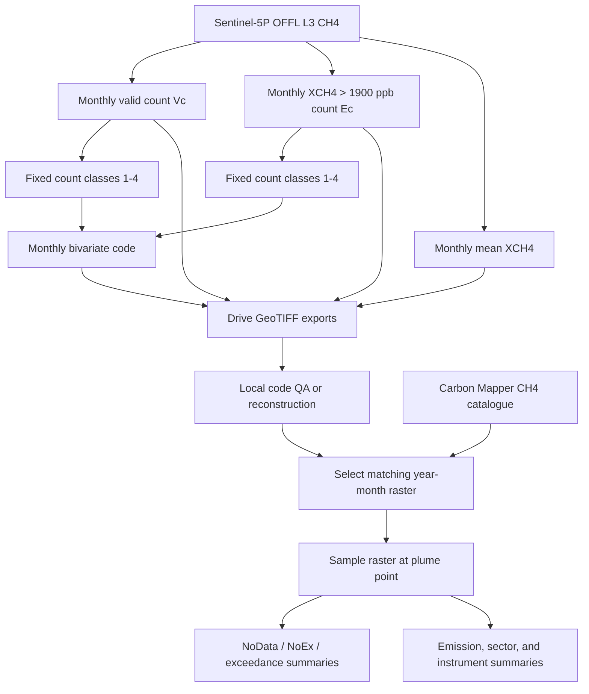

# Stage 2 Technical Reference

## Scope

Stage 2 creates monthly Sentinel-5P bivariate observation/exceedance classes
over CONUS and samples those classes at Carbon Mapper plume coordinates. The
pipeline is implemented in:

```text
stage2/stage2_complete_bivariate_pipeline_with_plume_matching.ipynb
```

## Data Flow



## Study Domain and Grid

The analysis region is built from the `TIGER/2018/States` Earth Engine
collection and includes the 48 conterminous state abbreviations. Alaska and
Hawaii are excluded.

Exports use:

```text
CRS: EPSG:4326
region: [-125, 24, -66, 50]
pixel size: 0.01 degrees
upper-left origin: (-125, 50)
```

The affine transform is:

```text
[0.01, 0, -125.0, 0, -0.01, 50.0]
```

Although the export region is a rectangle, monthly products are clipped to
the CONUS state geometry before export.

The angular grid is reproducible but not equal-area. Pixel ground dimensions
vary with latitude. Stage 2 counts observations and samples classes; it does
not calculate physical area from pixel counts.

## Sentinel-5P Monthly Products

Collection:

```text
COPERNICUS/S5P/OFFL/L3_CH4
```

Band:

```text
CH4_column_volume_mixing_ratio_dry_air_bias_corrected
```

For every calendar month:

### Valid-observation count

```text
valid_count = number of unmasked band observations per pixel
```

The Earth Engine implementation uses `ImageCollection.count()`, converts
masked output to zero, clips to CONUS, and stores signed 16-bit integers.

### Exceedance count

Each valid band image is thresholded:

```text
exceed = XCH4 > 1900 ppb
```

Thresholded images are summed by month, unmasked to zero, clipped to CONUS,
and stored as signed 16-bit integers.

### Monthly mean

The arithmetic image-collection mean is calculated for the selected band and
stored as floating point. It is exported for context but is not used to
construct the bivariate class.

## Fixed Count Classification

Both valid and exceedance counts use the same fixed bins:

```text
class 0: count = 0
class 1: 1 <= count <= 6
class 2: 7 <= count <= 12
class 3: 13 <= count <= 18
class 4: count >= 19
```

Let `vc` be the valid-count class and `ec` the exceedance-count class.

### Cross classes

When valid count and exceedance count are both positive:

```text
code = (vc - 1) * 4 + ec
```

This produces codes `1-16`:

| `vc` | `ec=1` | `ec=2` | `ec=3` | `ec=4` |
| ---: | ---: | ---: | ---: | ---: |
| 1 | 1 | 2 | 3 | 4 |
| 2 | 5 | 6 | 7 | 8 |
| 3 | 9 | 10 | 11 | 12 |
| 4 | 13 | 14 | 15 | 16 |

### NoEx classes

When valid count is positive and exceedance count is zero:

```text
code = 20 + vc
```

This produces `21-24`, retaining the valid-support class while representing
zero exceedances.

### NoData

Code `0` represents no valid monthly support. The local GeoTIFF profile also
uses `nodata=0`; therefore NoData and the file nodata marker intentionally
share one code.

## Earth Engine Exports

Each enabled month submits four independent
`ee.batch.Export.image.toDrive()` tasks. The default three-year range submits:

```text
3 years * 12 months * 4 products = 144 tasks
```

Exports use the fixed region, CRS, transform, `maxPixels=1e13`, and GeoTIFF
format. Earth Engine task submission is asynchronous. The notebook starts
tasks but does not poll for completion or retry failures.

The `dtype` argument on `export_image_to_drive()` is currently descriptive
only; image types are set before the function call and the argument is not
used inside the exporter.

## Local Bivariate Reconstruction

`build_bivar_np()` reproduces the Earth Engine encoding with NumPy. For each
month, the notebook finds one valid-count and one exceedance-count raster.

Before reconstruction it requires:

- identical array shapes;
- identical affine transforms;
- identical coordinate reference systems.

The output copies the valid-count raster profile and changes it to:

```text
dtype: uint8
count: 1
nodata: 0
compression: LZW
```

An existing bivariate file is preserved unless `overwrite=True`.

## Raster Quality Assurance

The expected code set is:

```text
0, 1-16, 21-24
```

For every bivariate file, QA records:

- filename;
- total pixel count;
- nonzero pixel count;
- observed codes;
- unexpected codes.

This is a code-domain check. It does not verify scientific correctness,
spatial alignment with external data, or monthly completeness.

## Plume Catalogue Standardization

The notebook chooses the first recognized column for longitude, latitude,
time, gas, emission, sector, and instrument. Longitude, latitude, and time are
required.

Standardized fields:

```text
longitude
latitude
datetime_parsed
year
month
year_month
gas_norm
```

Rows are retained when:

- gas normalizes to CH4, or the missing gas column is assumed CH4;
- coordinates are numeric;
- timestamps parse successfully as UTC;
- year falls inside the configured study period.

The code does not explicitly restrict the plume points to CONUS before
sampling. Points outside raster coverage normally receive nodata or another
driver-dependent sampled value and must be reviewed.

## Monthly Plume Matching

For each distinct plume year and month:

1. find the first matching bivariate GeoTIFF;
2. transform WGS84 plume coordinates to the raster CRS when needed;
3. sample band 1 at each point with `rasterio.sample()`;
4. attach the raster filename and integer class code;
5. use null class code when no monthly file exists.

This is point sampling at the reported plume coordinate. It does not evaluate
the plume footprint, buffer, nearest valid pixel, or exact Sentinel-5P
overpass time.

Decoded fields:

| Field | Meaning |
| --- | --- |
| `bivar_group` | `NoData`, `NoEx`, `Exceedance`, or `Unexpected` |
| `vc_class` | Valid-count class 1-4 |
| `ec_class` | Exceedance class 0-4 |
| `is_noex` | True for codes 21-24 |
| `is_nodata` | True for code 0 or missing support |
| `class_label` | Human-readable class such as `Vc3-Ec2` |

## Summaries

### Coverage summary

The central table counts:

- all plume records;
- records on classified bivariate pixels;
- records with NoData or missing monthly raster support.

### Emission summary

When a recognized emission field contains numeric values, the notebook sums
it for:

- NoEx classes;
- all non-NoEx classified classes;
- NoData.

It also reports NoEx and non-NoEx shares of the classified emission sum.
Values are not converted or normalized. The output unit is the unit of the
input field, and summing may be inappropriate if records are duplicated,
temporally repeated, or expressed in incompatible units.

### Bivariate matrices

The count and emission matrices use valid-count classes as rows and:

```text
NoEx, Ec1, Ec2, Ec3, Ec4
```

as columns. NoData records are excluded.

### Sector and instrument

When recognized fields exist, counts are grouped by bivariate class and the
source category. The sector figure keeps the 12 most populated bivariate
classes and eight most common sectors; remaining sectors are labeled
`Other`.

## Reproducibility Checklist

Record:

- repository commit hash;
- Earth Engine collection and band;
- threshold and study period;
- state collection and included state list;
- CRS, affine transform, and export region;
- Earth Engine task IDs and completion status;
- checksums for monthly GeoTIFFs;
- Carbon Mapper CSV filename and checksum;
- selected source-column mappings;
- input, filtered, classified, and NoData plume counts;
- missing months and unexpected raster codes;
- emission units and treatment of duplicate observations;
- package versions and execution date.

## Known Limitations

- The 1900 ppb threshold is fixed and not seasonally or regionally adaptive.
- Monthly aggregation removes exact overpass-time relationships.
- Valid and exceedance bins are methodological choices.
- A 0.01-degree grid is not equal-area.
- Sentinel-5P retrieval availability varies with clouds, albedo, latitude,
  season, and quality masking.
- Code `0` combines no valid observations with GeoTIFF nodata semantics.
- Plume matching samples one point rather than the full high-resolution plume.
- The first matching monthly filename is used when duplicate files exist.
- Raster sampling does not search for nearby valid pixels.
- Carbon Mapper observations are not a complete or uniform source census.
- Emission sums may include repeated source observations.
- Class association indicates monthly context, not direct plume validation or
  causal linkage.
