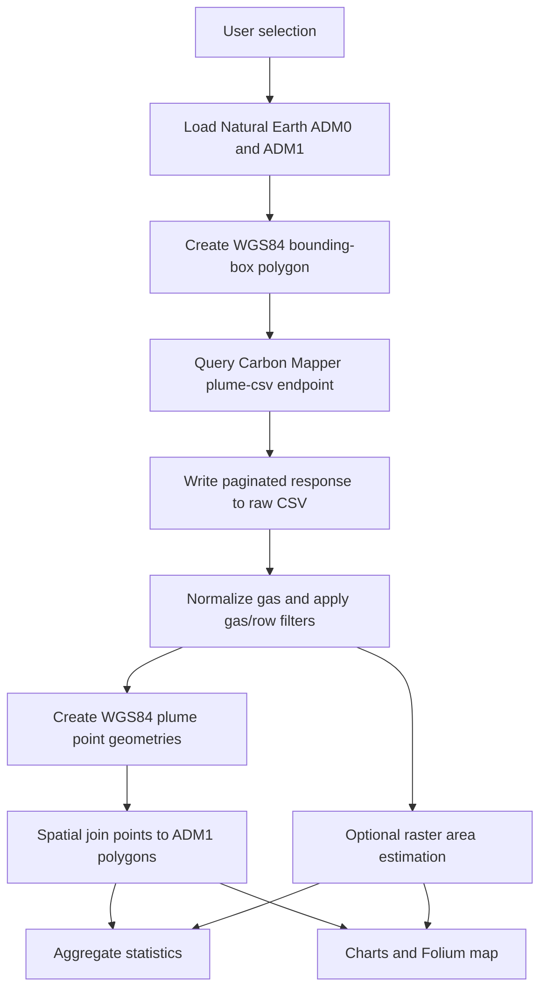

# Stage 0 Technical Reference

## Scope

Stage 0 is a notebook-oriented application implemented in
`stage0/cm_app_carbonmapper_only.py`. The `CMApp` class owns the widget state,
API workflow, tabular and spatial data, plots, and Folium maps. The launcher
notebook installs/imports the module, requests a token, and creates one
`CMApp` instance.

The component is deliberately limited to Carbon Mapper plume records and
Natural Earth administrative boundaries.

## Processing Pipeline



### 1. Administrative boundaries

`load_admin_boundaries()` reads Natural Earth 50 m archives first and falls
back to 10 m archives. ADM0 provides the country geometry. ADM1 provides
states/provinces and the `admin_name` field used by statistics and maps.

All query geometries and plume points use WGS84 (`EPSG:4326`).

### 2. Area of interest

`build_aoi_bbox()` creates a rectangular GeoJSON polygon from the total bounds
of either:

- the selected ADM1 polygons; or
- the entire ADM0 country polygon when no ADM1 unit is selected.

The API therefore receives a bounding box, not the exact country or
state/province polygon. Records are assigned to ADM1 units later through a
spatial join. Users should not interpret the raw CSV as already clipped to the
administrative boundary.

### 3. Carbon Mapper request

`download_carbonmapper_plumes()` sends a bearer-authenticated `GET` request to:

```text
https://api.carbonmapper.org/api/v1/catalog/plume-csv
```

Request parameters:

| Parameter | Value |
| --- | --- |
| `intersects` | JSON-encoded WGS84 bounding-box polygon |
| `datetime` | `<start-date>/<end-date>` |
| `limit` | 1 for the count request, then 1000 per page |
| `offset` | Increased by 1000 until the reported total is reached |

The first request reads the `pagination-count` response header. Subsequent
requests append CSV pages while removing duplicate headers. Request timeouts
are 60 seconds for the count request and 180 seconds for data pages.

The raw filename encodes rounded bounding coordinates and dates:

```text
cm_app_outputs/plumes_<south>_<north>_<west>_<east>_<YYYYMMDD>_<YYYYMMDD>.csv
```

The **Max plumes** widget is applied with `DataFrame.head()` after this
download. It limits analysis cost but does not reduce API transfer size.

### 4. Gas normalization

`ensure_gas_norm()` maps recognized values to `CH4` or `CO2`. If a usable
`gas` column is absent, it attempts to infer the gas from raster filename
fields such as `plume_tif`, `con_tif`, `rgb_tif`, `plume_png`, or `rgb_png`.
Unrecognized records become null and are excluded by gas-specific views.

### 5. Spatial assignment

The app requires:

```text
plume_latitude
plume_longitude
```

It constructs point geometry in `EPSG:4326`, transforms ADM1 boundaries to
the same CRS when necessary, and runs:

```python
geopandas.sjoin(..., how="left", predicate="within")
```

The joined `admin_name` is the grouping key. A left join preserves plume
records whose point is not assigned to an ADM1 polygon, although those null
administrative values are excluded from state/province summaries.

## Summary Statistics

`state_stats_for_gas()` filters by gas and optional selected ADM1 names, then
calculates:

| Output field | Definition |
| --- | --- |
| `rank` | Rank after sorting administrative units by plume count. |
| `admin_name` | Natural Earth ADM1 name. |
| `plume_count` | Number of joined plume records. |
| `area_sum_km2` | Sum of non-null exploratory area estimates. |
| `area_mean_km2` | Mean exploratory plume area. |
| `area_median_km2` | Median exploratory plume area. |
| `area_min_km2` | Minimum exploratory plume area. |
| `area_max_km2` | Maximum exploratory plume area. |
| `area_std_km2` | Standard deviation of exploratory plume area. |
| `emission_total` | Sum of non-null `emission_auto` values. |
| `emission_mean` | Mean of non-null `emission_auto` values. |
| `emission_median` | Median of non-null `emission_auto` values. |
| `emission_count` | Number of records with non-null `emission_auto`. |

Area and emission columns appear only when their source fields are available.
The app does not infer or convert the unit of `emission_auto`.

## Exploratory Plume-Area Estimation

Area estimation is optional because it performs an additional raster download
and raster operation for every processed plume.

### Preferred `con_tif` path

1. Download the concentration GeoTIFF referenced by `con_tif`.
2. Read band 1 as floating-point values.
3. Calculate the 95th percentile of finite pixels.
4. Mark pixels strictly above that percentile.
5. Reproject the binary mask with nearest-neighbor resampling to the World
   Cylindrical Equal Area CRS (`EPSG:6933`).
6. Multiply selected pixels by projected pixel area and convert square metres
   to square kilometres.

### Fallback `plume_tif` path

If `con_tif` is missing or fails, the app tries the visualization raster:

1. Read RGB and optional alpha bands.
2. Convert RGB values to HSV.
3. Select visible pixels with saturation at least 0.6, value between 0.35 and
   0.9, and red-end hue (`h <= 0.17` or `h >= 0.83`).
4. Apply one binary opening and closing operation when SciPy is available.
5. Retain the largest connected component.
6. Reproject to `EPSG:6933` and calculate selected pixel area.

Failures produce a null `plume_area_km2` value rather than stopping the full
query. These thresholds are implementation heuristics for exploratory
comparison, not a validated physical plume boundary.

## Visualization

### Charts

The chart view supports:

- plume count by ADM1;
- mean plume area by ADM1;
- per-plume area histogram;
- total `emission_auto` by ADM1 when available.

The table and chart are independently filtered by the chart gas toggle and the
current ADM1 selection.

### Map

The map uses CartoDB Positron tiles and a Folium choropleth. Available metrics
are selected from `plume_count`, `area_mean_km2`, `area_sum_km2`, and
`emission_total`, depending on the loaded columns.

Choropleth bins use the 0th, 20th, 40th, 60th, 80th, and 100th percentiles
when enough unique breakpoints exist; otherwise they use evenly spaced bins.

Point markers show available date, administrative unit, area, emission,
sector, instrument, and platform fields. CH4 markers are blue and CO2 markers
are red. The point-rendering limit affects map responsiveness only and does
not change statistics.

The optional heatmap gives every point equal weight unless area estimates are
available. Area weights are divided by the 95th-percentile area and clipped to
the range 0-1.

## Runtime Data Model

Important `CMApp` attributes after a successful query:

| Attribute | Content |
| --- | --- |
| `app.df_plumes` | Filtered pandas DataFrame used by the analysis. |
| `app.gdf_admin0` | Selected country boundary. |
| `app.gdf_admin1` | State/province boundaries for the country. |
| `app.gdf_joined` | Plume GeoDataFrame after the ADM1 spatial join. |
| `app.BASE_DIR` | Raw CSV output directory, default `./cm_app_outputs`. |

Public helper methods:

```python
app.compute_areas_now()
app.export_state_stats(path="state_stats.csv", gas="CH4")
app.save_map(path="map.html", gas="CH4", metric="plume_count")
```

## Reproducibility Checklist

Record the following with any exported result:

- repository commit hash;
- query execution date;
- API date interval;
- country and selected ADM1 units;
- selected gas;
- in-memory plume limit;
- whether area estimation was enabled;
- package versions;
- raw CSV filename or checksum;
- any API/data citation required by Carbon Mapper.

An environment snapshot can be saved with:

```bash
python -m pip freeze > environment-lock.txt
```

Do not commit that file unless it is intentionally being used as the
reproducibility lock for a specific thesis result.

## Known Limitations

- API and source schema changes can break expected fields.
- The bounding-box query can retrieve records outside irregular boundaries.
- `within` may not assign points exactly on polygon boundaries.
- Natural Earth boundaries are generalized and may not match authoritative
  national administrative data.
- Row limiting uses API order and is not random or statistically stratified.
- Area estimation is serial and can be slow for large selections.
- Raster thresholds are heuristic and vary with raster content.
- Aggregated plume records must not be interpreted automatically as unique
  sources, facilities, or independent emission events.
- Network-dependent boundaries, API pages, and raster URLs may change or
  become unavailable.
